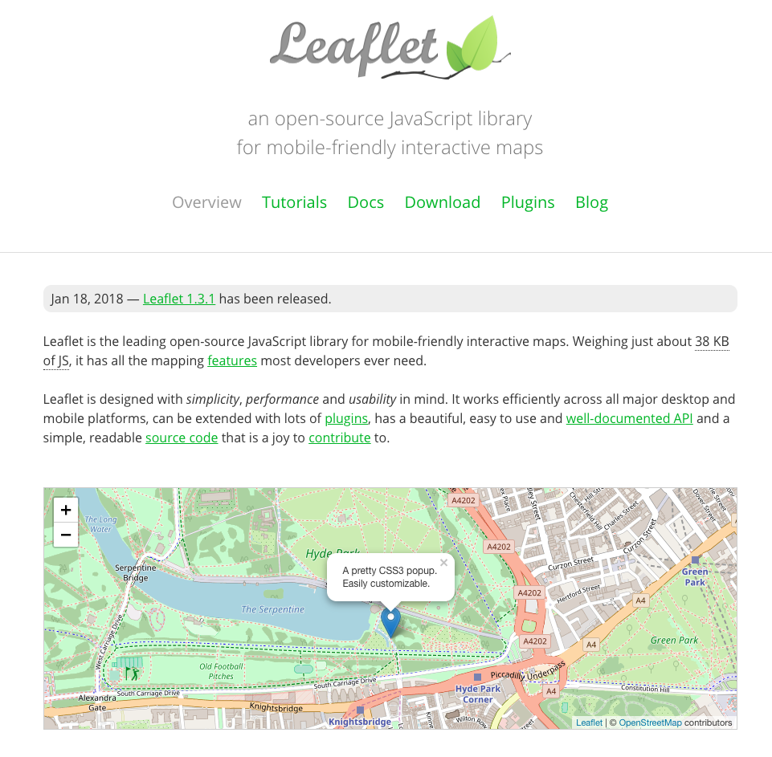
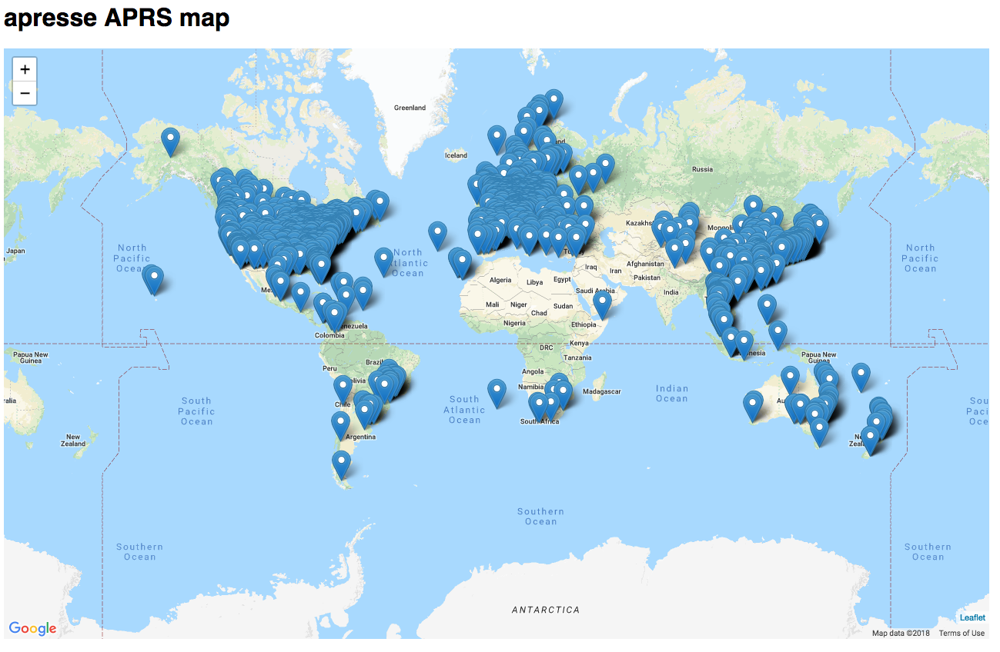
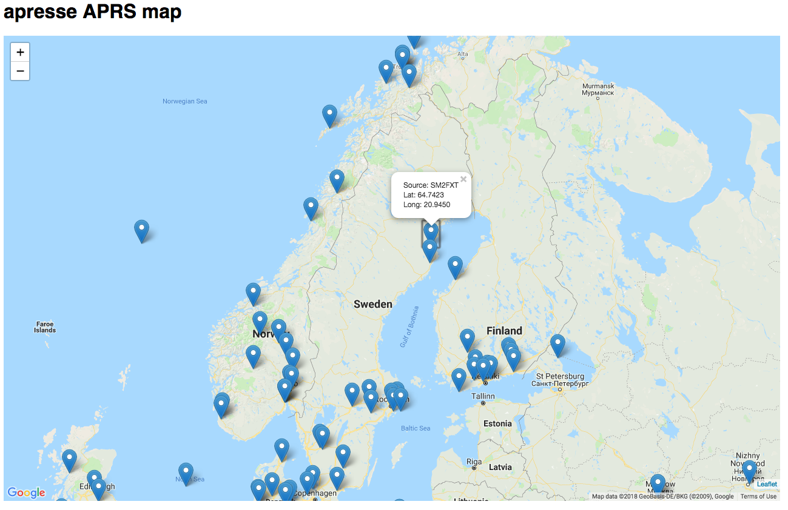

theme: Zurich, 1 
footer: Kenji Rikitake / Code BEAM STO 2018
slidenumbers: true

<!-- Use Deckset 2.0, aspect ratio 16:9 -->


# [fit] APRS-IS Servers on The BEAM [^*]

[^*]: ... Or how to prototype APRS-IS software on Erlang and Elixir quickly under a tight deadline

---


Kenji Rikitake
1-JUN-2018
Code Beam STO 2018
Stockholm, Sweden
@jj1bdx

---

# Topics

* Amateur Radio
* APRS and APRS-IS
* apresse: a simple mapping system
* Implementing apresse
* Summary

---

# Automatic Packet Reporting System (APRS) [^1]

* Amateur radio
* Short messaging (max 256 bytes)
* Broadcast on AX.25 UI frames
* Positing reporting and messaging

[^1]: APRS is a registered trademark of Bob Bruninga, WB4APR

---

# Amateur radio

> *amateur service*: A radiocommunication service for the purpose of self-training, intercommunication and technical investigations carried out by amateurs, that is, by duly authorized persons interested in radio technique solely with a personal aim and without pecuniary interest.  
-- ITU Radio Regulations, Number 1.56

---

# Amateur radio, in plain English

* Solely for technical experiments
* No business communication
* No cryptography, no privacy
* You need a license
* Pre-allocated radio spectrum only
* Third-party traffic handling is prohibited (expect for where allowed, and in case of emergency)

---

# Amateur radio privacy in the USA

* Anyone can intercept anything in the amateur radio bands (18 USC §2511(2)(g))
* Anyone can make a backup and disclosure of the information transmitted in amateur radio bands (18 USC chapter 121) 
* ... therefore **NO PRIVACY** [^2]

[^2]: Radio regulation details may differ in the country, region, or economy where the radio station operates.

---

# Then WHY amateur radio?

* You can *experiment* your ideas using radio transmitters and antennas
* It is an origin of all the internet cultures emerged after 1980s: sharing, helping each others, and the global friendship without borders
* ... and it's fun

---


# [fit] Me enjoying amateur packet radio, December 1986

---

# Messaging on amateur radio


* AX.25 protocol since 1980s
* 1200bps Bell202 + audio FM transceivers
* 9600bps GMSK + specific transceivers
* Modern gears: Raspberry Pi + SDR dongle for receiver

---

# So what is APRS anyway?

* Global network of amateur radio stations
* Broadcasting/receiving information like Twitter
* Aggregated information site: [aprs.fi](https://aprs.fi)
* Stations connected via APRS Internet Service (APRS-IS)

---

# [fit] A YouTube example of 1200bps AX.25/APRS sound [^3]


[^3]: by radionerd1, <https://www.youtube.com/watch?v=32yuWezqjrI>

---


---


---

# [fit] APRS-IS systems [^4]


* Very much like old USENET or modern messaging systems
* IGate systems are clients for the radio systems
* All contents are supposed to be on the amateur radio
* A text messaging system with the specific format

[^4]: quoted from <http://www.aprs-is.net/Specification.aspx>, by Peter Loveall, AE5PL

---

# APRS-IS messages

```
AK4VF>APRX28,TCPIP*,qAC,T2INDIANA:!3735.58NR07730.15W&↩
Raspberry Pi iGate
OE1W-11>APLWS2,qAU,OE1W-2:;N3620455 *140549h4821.65N/0↩
1621.32EO302/008/A=011516!wvl!Clb=-3.3m/s 403.50MHz ↩
Type=RS41 BK=Off
KB1EJH-13>APN391,TCPIP*,qAS,KB1EJH:@111405z3849.75N/07↩
519.50W_287/002g008t075r000p000P000h58b10151.DsVP
BA1GM-6>APLM2C,TCPIP*,qAS,BA1GM-6:=3952.10N/11631.65E>↩
272/049/A=000039http://www.aprs.cn 10X_12S_4.12V
```

---

# APRS-IS message formats

- Position reports (also timestamps, messages)
- Broadcast messages/bulletins and queries
- Objects and items
- Weather reports
- Telemetry data
- ... and many others

---

# apresse: a simple mapping system of APRS-IS

* Erlang part: retrieving information from APRS-IS and cache the position info in the ETS
* Elixir part: picking up the info from the ETS and show it to the Web browser when requested
* Browser: running mapping framework LeafLet with Google Maps

---

# What Erlang part of apresse does

* Connect to an APRS-IS (Tier-2) server
* Pull the messages and decode them
* Pick up the position data and store into ETS

---

# APRS-IS client code in Erlang

```erlang
connect_dump() ->
    {ok, Socket} = gen_tcp:connect("sweden.aprs2.net", 10152,
        [binary, {active, false}, {packet, line},
            {nodelay, true}, {keepalive, true}
        ]),
    {ok, _Prompt} = gen_tcp:recv(Socket, 0, 5000),
    ok = gen_tcp:send(Socket,
         "user N0CALL pass -1 vers apresse 0.01\n"),
         _C = connect_dump_receive_loop(Socket, 0,
                 aprs_is_decode:init_cp(), true),
    ok = gen_tcp:close(Socket).
```

---

# gen_tcp:connect/3 options

```erlang, [.highlight: 3-4]
connect_dump() ->
    {ok, Socket} = gen_tcp:connect("sweden.aprs2.net", 10152,
        [binary, {active, false}, {packet, line},
            {nodelay, true}, {keepalive, true}
        ]),
    {ok, _Prompt} = gen_tcp:recv(Socket, 0, 5000),
    ok = gen_tcp:send(Socket,
         "user N0CALL pass -1 vers apresse 0.01\n"),
         _C = connect_dump_receive_loop(Socket, 0,
                 aprs_is_decode:init_cp(), true),
    ok = gen_tcp:close(Socket).
```

---

# APRS-IS message header decoder in Erlang

```erlang
init_cp() -> {binary:compile_pattern(<<$>>>),
    binary:compile_pattern(<<$:>>),
    binary:compile_pattern(<<$,>>)}.
decode_header(D, {CPS, CPI, CPR}) ->
    [Header, InfoCRLF] = binary:split(D, CPI),
    [Source, Destrelay] = binary:split(Header, CPS),
    [Destination|Relay] = binary:split(
                            Destrelay, CPR, [global]),
    Info = binary:part(InfoCRLF, 0,
                       erlang:byte_size(InfoCRLF) - 2),
    {Source, Destination, Relay, Info}.
```

---

# APRS-IS message content decoder in Erlang

```erlang
info_dispatch(Info) ->
<<Type:8, Rest/binary>> = Info,
info_dispatch_type(Type, Rest).

info_dispatch_type(_, <<>>) -> {undefined, nofield};
info_dispatch_type($!, Field) ->
    position_nomsg(binary:first(Field), Field);
info_dispatch_type($=, Field) ->
    position_msg(binary:first(Field), Field);
%%% and the pattern matching continues...
```

---

# Decoded APRS-IS message example

```
F4BSX>APFD09,WIDE3-3,qAR,F1ZXR-3:=4313.61N/00134.33E↩
-PHG52NaN04/Dep:09 {UIV32}
Source: F4BSX
Destination: APFD09
Relay: [<<"WIDE3-3">>,<<"qAR">>,<<"F1ZXR-3">>]
Info: =4313.61N/00134.33E-PHG52NaN04/Dep:09 {UIV32}
Decoded: {position,no_message,{uncompressed,
 {{longlat,43.22683333333333,1.5721666666666665},{symid,47},
  <"-PHG52NaN04/Dep:09 {UIV32}">>}}}
```

---

# Storing positions in the ETS with Erlang

```erlang
ets_init()->
  ets:new(aprs_positions, [set, protected, named_table]).
put_ets({Source, _Dest, _Relay, Info}) ->
    Time = erlang:monotonic_time(millisecond),
    put_ets(Time, Source,
        parse_message(aprs_is_decode:info_dispatch(Info))).
put_ets(Time, Source, {Lat, Long}) ->
    % io:format("~p~n", [{Time, Source, Lat, Long}]),
    ets:insert(aprs_positions, {Time, Source, Lat, Long}).
```

---

# How ETS data are stored

```erlang,
6> ets:tab2list(aprs_positions).
[{-576459299045,<<"SR3NOW">>,51.6595,17.7965},
 {-576459323341,<<"HS3LIQ-2">>,
   14.9745,102.07033333333334},
 {-576459367284,<<"K3HQI-1">>,
   39.96216666666667,-76.801},
 {-576459335460,<<"LSBRG">>,38.580333333333336,
  -94.61716666666666},|...]
```
---

# Use ets:tab2list/1 to dump the ETS table

```erlang, [.highlight: 1]
6> ets:tab2list(aprs_positions).
[{-576459299045,<<"SR3NOW">>,51.6595,17.7965},
 {-576459323341,<<"HS3LIQ-2">>,
   14.9745,102.07033333333334},
 {-576459367284,<<"K3HQI-1">>,
   39.96216666666667,-76.801},
 {-576459335460,<<"LSBRG">>,38.580333333333336,
  -94.61716666666666},|...]
```
---

# Purging older ETS data

```erlang
-include_lib("stdlib/include/ms_transform.hrl").

ets_cleanup() ->
  T = erlang:monotonic_time(millisecond) - 180000,
  ets:select_delete(
    aprs_positions,
    ets:fun2ms(fun({Time, _, _, _}) -> Time < T end)).
```
      
---

# What Elixir part of apresse does

* Start the Erlang part and Web server
* When requested, create the position data for LeafLet
* Respond with all the headers and scripts of LeafLet as HTML

---

# ApresseWeb.Endpoint: web server in Plug

```elixir
defmodule ApresseWeb.Endpoint do
  use Plug.Builder
  plug Plug.Static,
       at: "/static", from: :apresse_web
  % default processing
  plug ApresseWeb.APRSMap
  plug :not_found
  plug :halt # and the code continues...
```

---

# Generating LeafLet markers by EEx template

```elixir
<%
popup = :io_lib.format(
  "Source: ~s<br>Lat: ~.4f<br>Long: ~.4f",
  [source, lat, long])
%>
var marker =
  L.marker([<%= lat %>, <%= long %>])
  .addTo(mymap).bindPopup('<%= popup %>');
```

---

# An excerpt from the result HTML

```JavaScript
<script>
  function showmap() {
    var mymap = L.map('mapid').setView([0.0, 0.0], 1);
    L.gridLayer.googleMutant({type: 'roadmap'}).addTo(mymap);
// Generated part
var marker = L.marker([-34.4095, 19.307166666666667])
.addTo(mymap).bindPopup('Source: ZR1TX<br>
Lat: -34.4095<br>Long: 19.3072');
// ... and the HTML continues
```

---

# Automatically generated by the EEX template

```JavaScript,[.highlight: 5-9]
<script>
  function showmap() {
    var mymap = L.map('mapid').setView([0.0, 0.0], 1);
    L.gridLayer.googleMutant({type: 'roadmap'}).addTo(mymap);
// Generated part
var marker = L.marker([-34.4095, 19.307166666666667])
.addTo(mymap).bindPopup('Source: ZR1TX<br>
Lat: -34.4095<br>Long: 19.3072');
// ... and the HTML continues
```

---



### [LeafLet](https://leafletjs.com/)

---



---



---

# How much code lines are needed for apresse 0.01

* Erlang code: 288 lines
* Elixir code: 121 lines without templates
* EEx template: 31 lines
* ... less than 500 lines in total

---

# Summary

* BEAM is for large-scale/high-concurrency
* BEAM is *not* restricted to the large-scale projects
* Starting small with BEAM languages (Erlang/Elixir) is a good way to prototype quickly
* You can use BEAM for small projects too
* Elixir and Erlang nicely coexist with each other by using proper building tools (mix and rebar3)

---

# [fit] Source code and data

# [fit] Github: [jj1bdx/apresse](https://github.com/jj1bdx/apresse)

---


# Acknowledgment

This presentation is suppored by
Pepabo R&D Institute, GMO Pepabo, Inc.

Thanks to Code BEAM Crew and Erlang Solutions!

... and thank you for being here!

---

# [fit] Thank you
# [fit] Questions?

---
[.autoscale: true]
# Photo credits

* Title: [Photo by Rob Bye on Unsplash](https://unsplash.com/photos/LphK1Oht5NA), modified by Kenji Rikitake
* APRS-IS system diagram: Peter Loveall
* Other images: Kenji Rikitake


<!--
Local Variables:
mode: markdown
coding: utf-8
End:
-->
