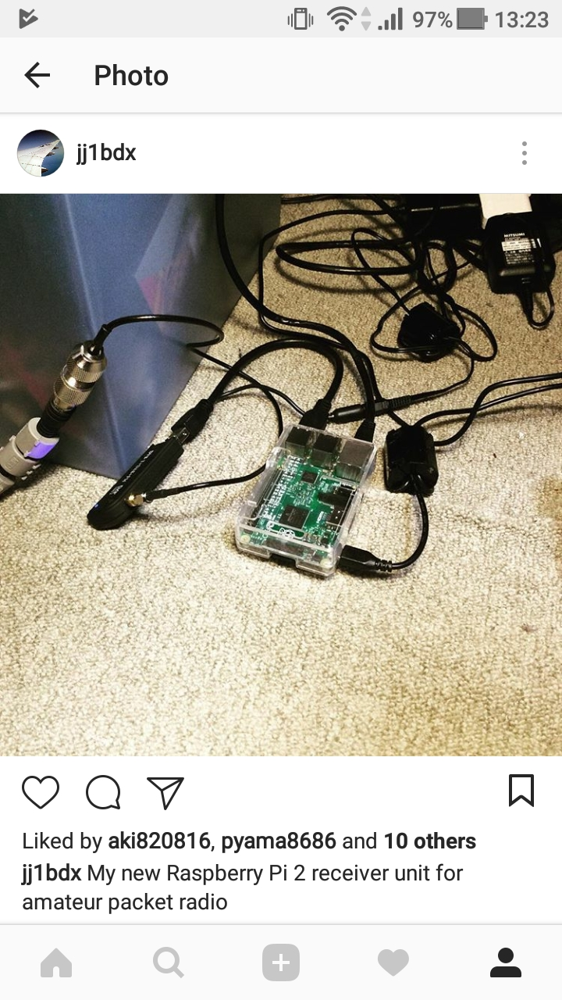
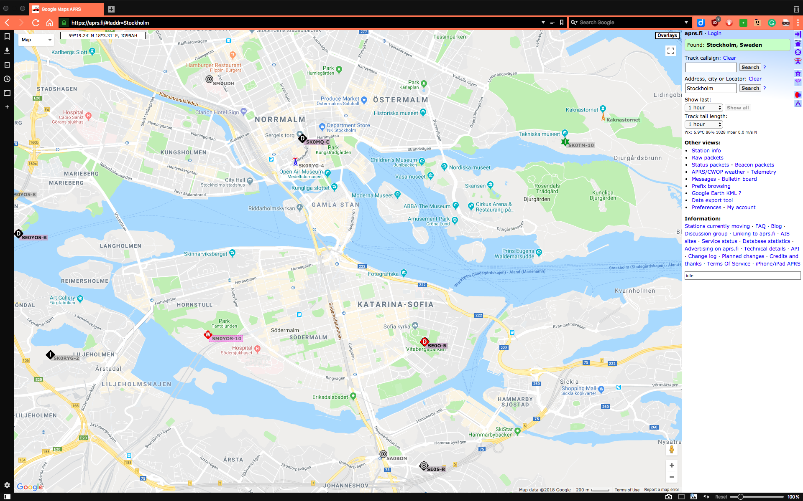
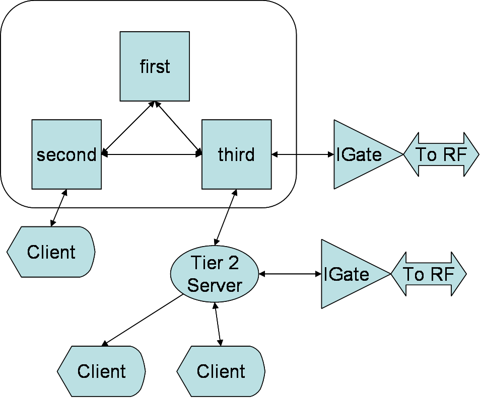

theme: Zurich, 1 
footer: Kenji Rikitake / Code BEAM STO 2018
slidenumbers: true

<!-- Use Deckset 2.0, aspect ratio 16:9 -->

# [fit] APRS-IS Servers on The BEAM

... or how to prototype APRS-IS software on Erlang and Elixir quickly under a tight deadline

---


Kenji Rikitake
1-JUN-2018
Code Beam STO 2018
Stockholm, Sweden
@jj1bdx

---

# Automatic Packet Reporting System (APRS) [^1]

* Amateur radio
* Short messaging (max 256 bytes)
* Broadcast on AX.25 UI frames
* Positing reporting and messaging

[^1]: APRS is a registered trademark of Bob Bruninga, WB4APR

---

# Amateur radio

> *amateur service*: A radiocommunication service for the purpose of self-training, intercommunication and technical investigations carried out by amateurs, that is, by duly authorized persons interested in radio technique solely with a personal aim and without pecuniary interest.  
-- ITU Radio Regulations, Number 1.56

---

# Amateur radio, in plain English

* Solely for technical experiments
* No business communication
* No cryptography, no privacy
* You need a license
* Pre-allocated radio spectrum only
* Third-party traffic handling is prohibited (expect for where allowed, and in case of emergency)

---

# Amateur radio privacy in the USA

* Anyone can intercept anything in the amateur radio bands (18 USC §2511(2)(g))
* Anyone can make a backup and disclosure of the information transmitted in amateur radio bands (18 USC chapter 121) 
* ... therefore **NO PRIVACY** [^2]

[^2]: Radio regulation details may differ in the country, region, or economy where the radio station operates.

---

# Then WHY amateur radio?

* You can *experiment* your ideas using radio transmitters and antennas
* It is an origin of all the internet cultures emerged after 1980s: sharing, helping each others, and the global friendship without borders
* ... and it's fun

---


# [fit] Me enjoying amateur packet radio, December 1986

---

# Messaging on amateur radio



* AX.25 protocol since 1980s
* 1200bps Bell202 + audio FM transceivers
* 9600bps GMSK + specific transceivers
* Modern gears: Raspberry Pi + SDR dongle for receiver

---

# So what is APRS anyway?

* Global network of amateur radio stations
* Broadcasting/receiving information like Twitter
* Aggregated information site: [aprs.fi](https://aprs.fi)
* Stations connected via APRS Internet Service (APRS-IS)

---

# [fit] A YouTube example of 1200bps AX.25/APRS sound [^3]


[^3]: by radionerd1, <https://www.youtube.com/watch?v=32yuWezqjrI>

---



---


---

# [fit] APRS-IS systems [^4]



* Very much like old USENET or modern messaging systems
* IGate systems are clients for the radio systems
* All contents are supposed to be on the amateur radio
* A text messaging system with the specific format

[^4]: quoted from <http://www.aprs-is.net/Specification.aspx>, by Peter Loveall, AE5PL

---

# APRS-IS messages

```
AK4VF>APRX28,TCPIP*,qAC,T2INDIANA:!3735.58NR07730.15W&↩
Raspberry Pi iGate
OE1W-11>APLWS2,qAU,OE1W-2:;N3620455 *140549h4821.65N/0↩
1621.32EO302/008/A=011516!wvl!Clb=-3.3m/s 403.50MHz ↩
Type=RS41 BK=Off
KB1EJH-13>APN391,TCPIP*,qAS,KB1EJH:@111405z3849.75N/07↩
519.50W_287/002g008t075r000p000P000h58b10151.DsVP
BA1GM-6>APLM2C,TCPIP*,qAS,BA1GM-6:=3952.10N/11631.65E>↩
272/049/A=000039http://www.aprs.cn 10X_12S_4.12V
```

---

# APRS-IS message example

```
DL1MBW-8>APAVT5,qAS,DC1MBB-10:>M-FC-178 K ↩
4.13V  34.3C AVRT5 20170403
%%% decoded as:
Source: DL1MBW-8
Destination: APAVT5
Relay: [<<"qAS">>,<<"DC1MBB-10">>]
Info: >M-FC-178 K 4.13V  34.3C AVRT5 20170403
Decoded: {status,
<<"M-FC-178 K 4.13V  34.3C AVRT5 20170403">>}
```

---

# APRS-IS message decoder in Erlang

```erlang
init_cp() ->
    {binary:compile_pattern(<<$>>>),
     binary:compile_pattern(<<$:>>),
     binary:compile_pattern(<<$,>>)}.

decode_header(D, {CPS, CPI, CPR}) ->
    [Header, InfoCRLF] = binary:split(D, CPI),
    [Source, Destrelay] = binary:split(Header, CPS),
    [Destination|Relay] = binary:split(Destrelay, CPR, [global]),
    Info = binary:part(InfoCRLF, 0, erlang:byte_size(InfoCRLF) - 2),
    {Source, Destination, Relay, Info}.
```

---

# Summary

* BEAM is designed for a large-scale and high concurrency projects
* The application of BEAM is *not* restricted to the large-scale projects
* Starting small with BEAM languages such as Erlang and Elixir is a good way to prototype
* You can use BEAM for small projects too

---


# Acknowledgment

This presentation is suppored by
Pepabo R&D Institute, GMO Pepabo, Inc.

Thanks to Code BEAM Crew and Erlang Solutions!

... and thank you for being here!

---

# [fit] Thank you
# [fit] Questions?

<!--
Local Variables:
mode: markdown
coding: utf-8
End:
-->
