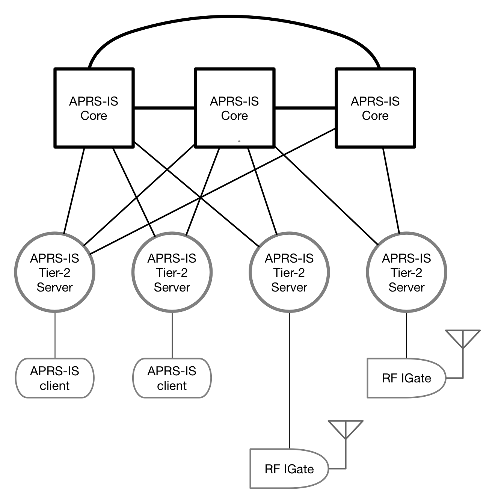

theme: Zurich, 1 
footer: Kenji Rikitake / Code BEAM STO 2018
slidenumbers: true

<!-- Use Deckset 2.0, aspect ratio 16:9 -->


# [fit] APRS-IS Servers on The BEAM [^*]

[^*]: ... Or how to prototype APRS-IS software on Erlang and Elixir quickly under a tight deadline

---


Kenji Rikitake
1-JUN-2018
Code Beam STO 2018
Stockholm, Sweden
@jj1bdx

^ Good afternoon, everybody. My name is Kenji Rikitake. I am going to talk about APRS-IS Servers on The BEAM.

---

# Topics

* Amateur Radio
* APRS and APRS-IS
* apresse: a simple mapping system
* Implementing apresse
* Prototyping small projects with BEAM

^ I have five topics to talk. First, amateur radio. Second, APRS and APRS-IS. Third is about apresse, a simple mapping system of Erlang APRS-IS client and Elixir Web server. Fourth, about implementing apresse. And the last topic explains the importance of prototyping small projects with BEAM and the languages.

---

# Automatic Packet Reporting System (APRS) [^1]

* Amateur radio
* Short messaging (max 256 bytes)
* Broadcast on AX.25 UI frames
* Positing reporting and bulletins

[^1]: APRS is a registered trademark of Bob Bruninga, WB4APR

^ APRS stands for Automatic Packet Reporting System. It's a part of amateur radio, providing a short message service. Each message is 256 of less bytes. All messages are broadcast as AX.25 UI frames, which is a connection-less protocol, over the radio. The main purpose of APRS is position reporting and bulletins. 

---

# Amateur radio

> *amateur service*: A radiocommunication service for the purpose of self-training, intercommunication and technical investigations carried out by amateurs, that is, by duly authorized persons interested in radio technique solely with a personal aim and without pecuniary interest.  
-- ITU Radio Regulations, Number 1.56

^ Let me explain about amateur radio. International Telecommunication Union defines amateur radio as a service for self-training and technical investigations, solely with a personal aim and without pecuniary interest.

---

# Amateur radio, in plain English

* Solely for technical experiments
* No business communication
* No cryptography, no privacy
* You need a license
* Pre-allocated radio spectrum only
* Third-party traffic handling is prohibited (expect for where allowed, and in case of emergency)

^ Let me explain amateur radio again in plain English. It's solely for technical experiments, so no business communication allowed, no cryptography, and no privacy. You have to be authoized so you need to have a license. The activities are restricted in allocated bands only. And third-party traffic handling is prohibited by general, except for in case of emergency, and where it is allowed, such as in the USA and Canada. But not in Sweden. Or Japan.

---

# Amateur radio privacy in the USA

* Anyone can intercept anything in the amateur radio bands (18 USC §2511(2)(g))
* Anyone can make a backup and disclosure of the information transmitted in amateur radio bands (18 USC chapter 121) 
* ... therefore **NO PRIVACY** [^2]

[^2]: Radio regulation details may differ in the country, region, or economy where the radio station operates.

^ I would like to remind that USA criminal law claims intercepting, recording, and disclosing amateur radio traffic are not crimes. Everybody can do this. So in the APRS. So no privacy.

---

# Then WHY amateur radio?

* You can *experiment* your ideas using radio transmitters and antennas
* It is an origin of all the internet cultures emerged after 1980s: sharing, helping each others, and the global friendship without borders
* ... and it's fun

^ Amateur radio service is very much restricted, but many people including myself are enjoying it. Why? One of the reasons is that you can build your own equipments and antennas. In professional communications, you can't, because all systems must be approved before using them. And amateur radio has been an origin of all the internet-like cultures; sharing, helping each others, and the global friendship without borders.

---


# [fit] Me enjoying amateur packet radio, December 1986

^ This is me on December 1986, about 32 years ago, enjoying text chatting over the radio. The technology hasn't been changed much for more than 30 years.

---

# Messaging on amateur radio


* AX.25 protocol since 1980s
* 1200bps Bell202 + audio FM transceivers
* 9600bps GMSK + specific transceivers
* Modern gears: Raspberry Pi + SDR dongle for receiver

^ Messaging on amateur radio is based on AX.25, a packet framing protocol, similar to the old X.25 for the world-wide professional packet communication networks, but the addresses used are the callsigns of the stations. The physical layer is FM voice-grade technology, so 1200bps audio FSK is still popular. Some people use higher speed of 9600bps with more efficient modulation scheme in the same bandwidth. You can decode those signals by a Raspberry Pi and a software defined receiver USB dongle.


---

# So what is APRS anyway?

* Global network of amateur radio stations
* Broadcasting/receiving text messages like Twitter
* Aggregated information site: [aprs.fi](https://aprs.fi)
* Stations connected via APRS Internet Service (APRS-IS)

^ Let's talk about APRS. APRS is a global network of amateur radio stations, exchanging text messages like Twitter, by broadcasting. You can check out the aggregated activity map at aprs.fi. All incoming information of APRS are gathered through the Internet Service, APRS-IS.

---

# [fit] A YouTube example of 1200bps AX.25/APRS sound [^3]


[^3]: by radionerd1, <https://www.youtube.com/watch?v=32yuWezqjrI>

^ This is an example video on YouTube showing how APRS in 1200bps sounds on the radio.

---


^ This is a map of Stockholm on aprs.fi. You can see the Tekniska Museet, the Technoogy Museum, has the own station, called SK0TM.

---


^ This is a map of Toyonaka, where I live in Japan, on aprs.fi.

---

# [fit] APRS-IS systems [^4]



* Similar to USENET or modern messaging systems
* IGate systems are clients for the radio systems
* All contents are supposed to be on the amateur radio
* Status: <http://status.aprs2.net/>

[^4]: Diagram based on the design from <http://www.aprs-is.net/Specification.aspx>, by Peter Loveall, AE5PL

^ Let me explain about APRS-IS. It's similar to USENET, or modern messaging systems in general. It has the core systems, and the Tier-2 systems, so that the core doesn't need to handle the individual clients, and the Tier-2 servers act as the interface layer. The clients which have radio transmission capability are called IGates. Your messages on APRS-IS can be broadcast on the amateur radio at any time. The traffic handled by the network is about 500~900 kilobytes/sec.


---

# APRS-IS messages

```
AK4VF>APRX28,TCPIP*,qAC,T2INDIANA:!3735.58NR07730.15W&↩
Raspberry Pi iGate
OE1W-11>APLWS2,qAU,OE1W-2:;N3620455 *140549h4821.65N/0↩
1621.32EO302/008/A=011516!wvl!Clb=-3.3m/s 403.50MHz ↩
Type=RS41 BK=Off
KB1EJH-13>APN391,TCPIP*,qAS,KB1EJH:@111405z3849.75N/07↩
519.50W_287/002g008t075r000p000P000h58b10151.DsVP
BA1GM-6>APLM2C,TCPIP*,qAS,BA1GM-6:=3952.10N/11631.65E>↩
272/049/A=000039http://www.aprs.cn 10X_12S_4.12V
```

^ These text messages are examples of APRS-IS messages. Each message consists of a single line text. It has the header part before the first colon, and the rest is the information part. The string before the "greater than" sign is the source address, and after the sign is the destination address, succeeded by the identifiers of relaying destinations.

---

# APRS-IS message conveys

- Position reports (also timestamps, messages)
- Broadcast messages/bulletins and queries
- Objects and items
- Weather reports
- Telemetry data
- ... and many others

^ APRS-IS conveys many types of information. The most popular ones are position reports including latitude and longitude of the transmitting stations or other entities. Some may include broadcast messages and queries. Objects and items are for describing specific entities often with their position data. Other types of data include the weather reports and telemetry values.

---

# apresse: a simple mapping system of APRS-IS

* Erlang part: retrieving information from APRS-IS and cache the position info in the ETS
* Elixir part: picking up the info from the ETS and show it to the Web browser when requested
* Browser: running mapping framework LeafLet with Google Maps

^ I am going to explain my prototype system called apresse, made of an Erlang APRS-IS client and an Elixir Web server. Apresse shows the positions of APRS-IS position messages to the map on the browser. The Erlang part retrieves information from APRS-IS and stores a limited time of received position data in the ETS cache. The Elixir part picks up the data in the ETS and show it to the Web browser, using the framework called LeafLet.

---

# What Erlang part of apresse does

* Connect to an APRS-IS (Tier-2) server
* Pull the messages and decode them
* Pick up the position data and store into ETS

^ The Erlang part of apresse first connects to an APRS-IS Tier-2 server with gen_tcp:connect/3, then logs into the system and retrieve all the received information Each message is parsed and decoded, and if it contains a position data it is stored into an ETS table.

---

# APRS-IS client code in Erlang

```erlang
connect_dump() ->
    {ok, Socket} = gen_tcp:connect("sweden.aprs2.net", 10152,
        [binary, {active, false}, {packet, line},
            {nodelay, true}, {keepalive, true}
        ]),
    {ok, _Prompt} = gen_tcp:recv(Socket, 0, 5000),
    ok = gen_tcp:send(Socket,
         "user N0CALL pass -1 vers apresse 0.01\n"),
         _C = connect_dump_receive_loop(Socket, 0,
                 aprs_is_decode:init_cp(), true),
    ok = gen_tcp:close(Socket).
```

^ This is an example APRS-IS client code in Erlang. It requests the TCP connection to the port 10152, which is for the full feed of APRS-IS, and receives the server prompt, then send the authentication information, and receive the rest of the contents as the messages from the server.

---

# gen_tcp:connect/3 options

```erlang, [.highlight: 3-4]
connect_dump() ->
    {ok, Socket} = gen_tcp:connect("sweden.aprs2.net", 10152,
        [binary, {active, false}, {packet, line},
            {nodelay, true}, {keepalive, true}
        ]),
    {ok, _Prompt} = gen_tcp:recv(Socket, 0, 5000),
    ok = gen_tcp:send(Socket,
         "user N0CALL pass -1 vers apresse 0.01\n"),
         _C = connect_dump_receive_loop(Socket, 0,
                 aprs_is_decode:init_cp(), true),
    ok = gen_tcp:close(Socket).
```

^ The socket options of gen_tcp:connect/3 means that the received data are treated as binaries, passive only so receive calls are required to pick up the message, and each message is separated as a text line, so as the APRS-IS messages. The NODELAY and KEEPALIVE options are for making the TCP connection more reliable.

---

# APRS-IS message header decoder in Erlang

```erlang
init_cp() -> {binary:compile_pattern(<<$>>>),
    binary:compile_pattern(<<$:>>),
    binary:compile_pattern(<<$,>>)}.
decode_header(D, {CPS, CPI, CPR}) ->
    [Header, InfoCRLF] = binary:split(D, CPI),
    [Source, Destrelay] = binary:split(Header, CPS),
    [Destination|Relay] = binary:split(
                            Destrelay, CPR, [global]),
    Info = binary:part(InfoCRLF, 0,
                       erlang:byte_size(InfoCRLF) - 2),
    {Source, Destination, Relay, Info}.
```

^ This is an example of decoding APRS-IS message headers on Erlang. It is based on the binary:split/{2,3} functions. The matching patterns are precompiled by binary:compile_pattern/1 for faster processing speed, and passed on to the decoding function.

---

# APRS-IS message content decoder in Erlang

```erlang
info_dispatch(Info) ->
<<Type:8, Rest/binary>> = Info,
info_dispatch_type(Type, Rest).

info_dispatch_type(_, <<>>) -> {undefined, nofield};
info_dispatch_type($!, Field) ->
    position_nomsg(binary:first(Field), Field);
info_dispatch_type($=, Field) ->
    position_msg(binary:first(Field), Field);
%%% and the pattern matching continues...
```

^ The information part extracted from an APRS-IS message is later processed by a dispatching function. This function sees the first byte of the information part, which shows the type of the message, and calls the type-specific function for the further processing, by the pattern matching.

---

# Decoded APRS-IS message example

```
F4BSX>APFD09,WIDE3-3,qAR,F1ZXR-3:=4313.61N/00134.33E↩
-PHG52NaN04/Dep:09 {UIV32}
Source: F4BSX
Destination: APFD09
Relay: [<<"WIDE3-3">>,<<"qAR">>,<<"F1ZXR-3">>]
Info: =4313.61N/00134.33E-PHG52NaN04/Dep:09 {UIV32}
Decoded: {position,no_message,{uncompressed,
 {{longlat,43.22683333333333,1.5721666666666665},{symid,47},
  <"-PHG52NaN04/Dep:09 {UIV32}">>}}}
```

^ This is a decoding example of an APRS-IS message. The source identifier or callsign is F4BSX, presumably in France. The message contains positional data of 43.227 degrees North and 1.572 degrees East in the latitude and longitude. 

---

# Storing positions in the ETS with Erlang

```erlang
ets_init()->
  ets:new(aprs_positions, [set, protected, named_table]).
put_ets({Source, _Dest, _Relay, Info}) ->
    Time = erlang:monotonic_time(millisecond),
    put_ets(Time, Source,
        parse_message(aprs_is_decode:info_dispatch(Info))).
put_ets(Time, Source, {Lat, Long}) ->
    % io:format("~p~n", [{Time, Source, Lat, Long}]),
    ets:insert(aprs_positions, {Time, Source, Lat, Long}).
```

^ Once you get the position data with the source identifier with the corresponding latitude and longitude data, you can put the data into ETS. In apresse, each of the data are recorded with the monotonic time information, so that old data can be expired and removed.

---

# How ETS data are stored

```erlang,
6> ets:tab2list(aprs_positions).
[{-576459299045,<<"SR3NOW">>,51.6595,17.7965},
 {-576459323341,<<"HS3LIQ-2">>,
   14.9745,102.07033333333334},
 {-576459367284,<<"K3HQI-1">>,
   39.96216666666667,-76.801},
 {-576459335460,<<"LSBRG">>,38.580333333333336,
  -94.61716666666666},|...]
```

^ This is an example of the dumped ETS table called aprs_positions, which contains the identifier and the position data with the timestamp.

---

# Use ets:tab2list/1 to dump the ETS table

```erlang, [.highlight: 1]
6> ets:tab2list(aprs_positions).
[{-576459299045,<<"SR3NOW">>,51.6595,17.7965},
 {-576459323341,<<"HS3LIQ-2">>,
   14.9745,102.07033333333334},
 {-576459367284,<<"K3HQI-1">>,
   39.96216666666667,-76.801},
 {-576459335460,<<"LSBRG">>,38.580333333333336,
  -94.61716666666666},|...]
```

^ For dumping all the data in an ETS table, you can use ets:tab2list/1, with the name of the table.

---

# Purging older ETS data

```erlang
-include_lib("stdlib/include/ms_transform.hrl").

ets_cleanup() ->
  T = erlang:monotonic_time(millisecond) - 180000,
  ets:select_delete(
    aprs_positions,
    ets:fun2ms(fun({Time, _, _, _}) -> Time < T end)).
```

^ This is a purging function example. It has to include a file for ms_transform, which performs the parse transform function so that a function style description can be used as a match pattern for deleting the data of the matched pattern from an ETS table. In this example, all data which has earlier timestamps than the given threshold in the variable T, which is 3 minutes before the current time, will be deleted from the table.

---

# What Elixir part of apresse does

* Start the Erlang part and Web server
* When requested, create the position data for LeafLet
* Respond with all the headers and scripts of LeafLet as HTML

^ Let me explain the Elixir part of apresse. The data collected in the ETS by the Erlang part shoule be provided to the Web browser when requested. The Elixir part generates the Web page data based on the contents of the ETS table, with the mapping JavaScript framework called LeafLet.

---

# ApresseWeb.Endpoint: web server in Plug

```elixir
defmodule ApresseWeb.Endpoint do
  use Plug.Builder
  plug Plug.Static,
       at: "/static", from: :apresse_web
  % default processing
  plug ApresseWeb.APRSMap
  plug :not_found
  plug :halt # and the code continues...
```

^ The Plug framework is used to describe the server in Elixir. The Plug.Static part provides necessary files to the browser for the LeafLet framework. The ApresseWeb.APRSMap modules is the generator of LeafLet data from the ETS table contents.

---

# Generating LeafLet markers by EEx template

```elixir
<%
popup = :io_lib.format(
  "Source: ~s<br>Lat: ~.4f<br>Long: ~.4f",
  [source, lat, long])
  %>
```
```javascript
var marker =
  L.marker([<%= lat %>, <%= long %>])
  .addTo(mymap).bindPopup('<%= popup %>');
```

^ Elixir EEx templates are used for putting the ETS table data efficiently into the JavaScript skeleton. The io_lib:format code generates a popup string when the marker representing the data is clicked, which shows only four digits after the decimal points of the latitude and longitude data.

---

# An excerpt from the result HTML

```javascript
// LeafLet map part 
var mymap = L.map('mapid').setView([0.0, 0.0], 1);
L.gridLayer.googleMutant({type: 'roadmap'}).addTo(mymap);
// Generated part
var marker = L.marker([-34.4095, 19.307166666666667])
.addTo(mymap).bindPopup('Source: ZR1TX<br>
Lat: -34.4095<br>Long: 19.3072');
// ... and the HTML continues
```

^ This is an example of the generated HTML from the Elixir server. The first lines are static part which represents the LeafLet map object. The marker part is generated by the Elixir code based on the ETS table data.

---

# Automatically generated by the EEX template

```javascript, [.highlight: 5-7]
// LeafLet map part 
var mymap = L.map('mapid').setView([0.0, 0.0], 1);
L.gridLayer.googleMutant({type: 'roadmap'}).addTo(mymap);
// Generated part
var marker = L.marker([-34.4095, 19.307166666666667])
.addTo(mymap).bindPopup('Source: ZR1TX<br>
Lat: -34.4095<br>Long: 19.3072');
// ... and the HTML continues
```

^ Here the generated data part is highlighted.

---


### [LeafLet](https://leafletjs.com/)

^ This is the web page of LeafLet. It gives a versatile interface of mapping objects into geographical maps of various origin. In apresse, a plugin called LeafLet.GridLayer.GoogleMutant to display the Google Maps base layers.

---


^ This is an example of the output of apresse showing the whole world.

---


^ And this is an example of the output of apresse, showing Sweden and the Scandinavia, with a popup of the station called SM2FXT.

---

# How much code lines are needed for apresse 0.01

* Erlang code: 288 lines
* Elixir code: 121 lines without templates
* EEx template: 31 lines
* Total: 440 lines

^ I'd like to explain the number of code lines for apresse version 0.01, the first version. The total number of code lines including Erlang, Elixir, and the EEx templates is 440, which is very small. I'm pleasantly surprised by the result of such a fast prototyping under a limited amount of time.

---

# Prototyping small projects with BEAM

* BEAM is for large-scale/high-concurrency
* BEAM is *not* restricted to the large-scale projects
* Starting small with BEAM languages (Erlang/Elixir) is a good way to prototype quickly
* You can use BEAM for small projects too
* Elixir and Erlang nicely coexist with each other by using proper building tools (mix and rebar3)

^ To summarize this talk, I'd like to emphasize the BEAM and the languages such as Erlang and Elixir are doing very well for small system prototyping. BEAM can handle larger systems, but BEAM does also very well for smaller systems. Starting small with BEAM and the languages is actually a very good way for prototyping quickly. You can put Erlang and Elixir in the same project by using the building tools in a proper way.

---

# [fit] Source code and data

# [fit] Github: [jj1bdx/apresse](https://github.com/jj1bdx/apresse)

^ All the source code and data are available in my GitHub repository.

---


# Acknowledgment

This presentation is suppored by
Pepabo R&D Institute, GMO Pepabo, Inc.

Thanks to Code BEAM Crew and Erlang Solutions!

... and thank you for being here!

^ I'd like to thank my sponsor Pepabo R&D Institute of GMO Pepabo for supporting this presentation, and to the Code BEAM Crew and Erlang Solutions as always. And thank you very much for being here!

---

# [fit] Thank you
# [fit] Questions?

^ Any questions?

---
[.autoscale: true]
# Photo credits

* Title: [Photo by Rob Bye on Unsplash](https://unsplash.com/photos/LphK1Oht5NA), modified by Kenji Rikitake
* Other images: Kenji Rikitake


<!--
Local Variables:
mode: markdown
coding: utf-8
End:
-->
